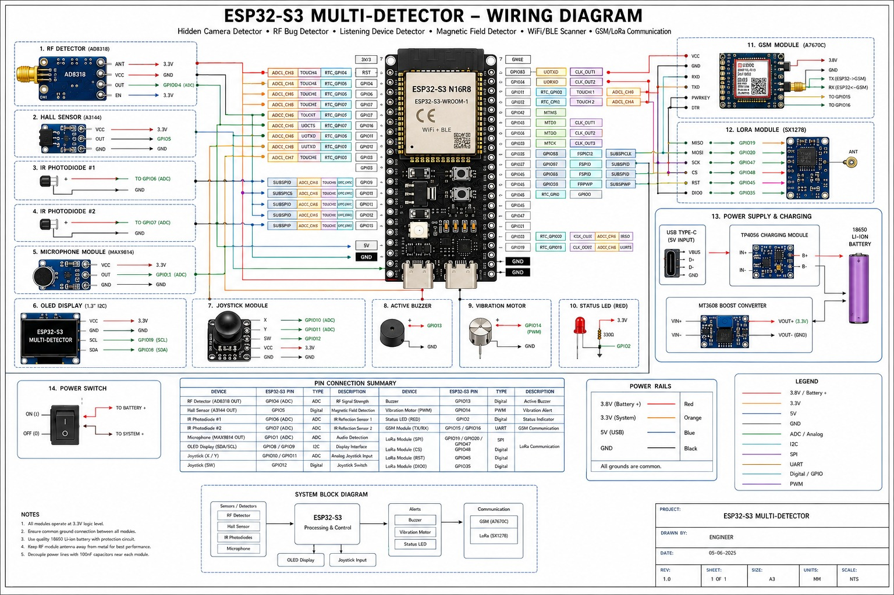
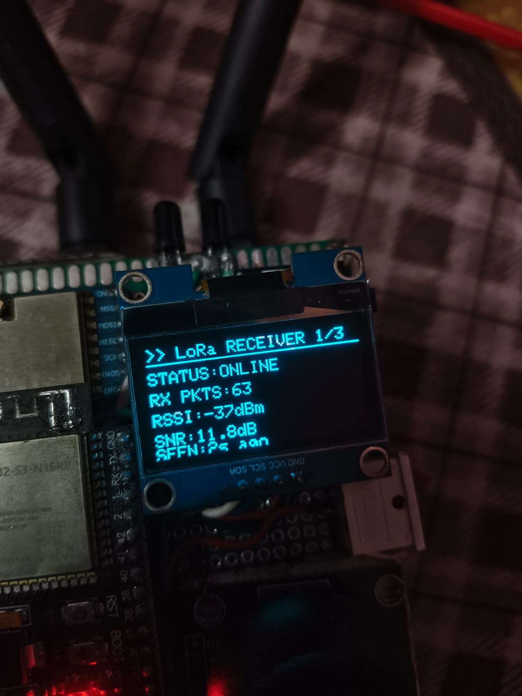

# 🔍 ESP32-S3 MultiDetector

A handheld **multi-sensor security & RF analysis device** built on the ESP32-S3 — WiFi/BLE recon, RF spectrum analysis, hidden camera detection, GSM SMS alerting, and long-range LoRa remote control, all on a 128×64 OLED with a joystick UI.


---

## ✨ Features

| Mode | What it does |
|------|-------------|
| 📡 **RF Scanner** | AD8318 logarithmic power meter — live spectrum, dB meter, peak hold, history graph, spike alerts, burst statistics. Auto-calibrating baseline. |
| 📶 **WiFi Scanner** | Scans up to 50 networks with RSSI, channel, security, BSSID. Long-press to launch **deauth + Evil Twin (rogue AP with cloned BSSID) + handshake replay** module. |
| 🔵 **BLE Scanner** | Passive BLE beacon discovery (50 devices), per-device info: MAC, RSSI, signal quality, last-seen. |
| 📱 **Phone Detector** | Sensor-fusion close-range phone detection — combines BLE + WiFi hotspot RSSI thresholds and RF spikes into a confidence score with distance estimation. **Completely silent until a phone is confirmed.** |
| 🧲 **Magnetic Field** | Hall-effect sensor — detects magnetic flux (finds magnets, speakers, hidden devices). |
| 🔊 **Audio Detect** | Mic amplitude monitoring with peak-hold and detection threshold. |
| 📷 **Hidden Camera** | Lens-reflection detection with auto baseline/noise-floor calibration, deviation bar, and confidence readout. |
| 📻 **LoRa Radio** | Full remote terminal for a paired WROOM node over 433 MHz — live telemetry, target info, attack status, command log, ACK tracking, and a 13-mode remote mode selector. |
| 📲 **GSM (A7670C)** | SMS alerts to 3 numbers on any detection event, quick-SMS menu (status report, battery, emergency), signal quality, network/operator info, SIM status + ICCID. |
| ⚙️ **Settings** | Live system health dashboard — battery, sensor, LoRa and GSM status. |

**Alerts:** Buzzer + vibration motor + LED on detection, plus automatic **SMS alert** with cooldown logic so you never get spammed.

---

## 🎮 Controls

The whole UI is driven by one analog joystick:

| Action | Effect |
|--------|--------|
| ↑ / ↓ | Navigate menus, scroll lists, switch RF sub-views / terminal pages |
| → | Enter / open / select |
| ← | Back to menu |
| Short press | Select / confirm |
| **Long press (WiFi mode)** | ⚔️ Start/stop deauth + Evil Twin attack on selected network |
| **Long press (LoRa mode)** | Open remote mode selector |
| **Short press (LoRa mode)** | Toggle VIEW ↔ CONTROL (joystick sends remote commands) |

---

## 🔌 Hardware

### Wiring

| Component | ESP32-S3 GPIO | Notes |
|-----------|--------------|-------|
| OLED SH1106 (I2C) | SDA=8, SCL=9 | 128×64, addr `0x3C` |
| AD8318 RF detector | GPIO 10 | Analog in, slope 0.024 V/dB |
| Hall sensor | GPIO 11 | Active-low (INPUT_PULLUP) |
| Microphone | GPIO 1 | Analog |
| Camera-sensor photodiode | GPIO 7 | Analog |
| Buzzer | GPIO 5 | Active HIGH |
| Vibration motor | GPIO 6 | Active HIGH |
| Status LED | GPIO 18 | |
| Battery divider | GPIO 12 | 100K/100K divider → ×2 scale |
| Joystick X / Y / SW | 15 / 16 / 17 | SW is active-low |
| **LoRa SX1278** | CS=2, RST=3, DIO0=35, SCK=13, MOSI=14, MISO=21 | Dedicated SPI bus |
| **GSM A7670C** | RX=0, TX=36, PEN=38, PWK=39 | UART1 @ 115200 |

### Suggested parts
- ESP32-S3 dev board
- SH1106 1.3" OLED
- AD8318 RF power detector module (or any log-detector)
- SX1278 (Ra-02) LoRa module
- A7670C 4G GSM/GPS module + SIM
- KY-024-style hall sensor, electret mic, photodiode, joystick, buzzer, vibration motor, Li-ion cell + charge board

---

## 🛠️ Build & Flash

1. **Arduino IDE** → install the **ESP32 board package** (v2.x or v3.x)
2. **Libraries** (Library Manager):
   - `Adafruit SH110X` + `Adafruit GFX Library`
   - `LoRa` by Sandeep Mistry
3. **Phone numbers** — set your alert numbers:
   ```cpp
   const char* ALERT_PHONES[] = {"+91XXXXXXXXXX", "+91XXXXXXXXXX", "+91XXXXXXXXXX"};
   ```
4. Board: your ESP32-S3 variant → **Upload**

> The `wifi_bypass.c` file must sit **next to the `.ino`** — it wraps `ieee80211_raw_frame_sanity_check` so raw 802.11 frames can be transmitted. Arduino compiles `.c` files in the sketch folder automatically. No extra build flags needed.

---

## 📡 LoRa Protocol (WROOM link)

Remote node communicates over 433 MHz, SF12 / 125 kHz / CR 4/8, sync word `0xF3`:

| Packet | Direction | Purpose |
|--------|-----------|---------|
| `$WROOM,wifi,ble,attack,uptime*` | → | Legacy telemetry broadcast |
| `$ST,mode,menu,wifi,ble,sel,attack,pkts,errs,uptime,tgtSSID,tgtRSSI,tgtCH,tgtSEC,top1,r1,top2,r2,top3,r3*` | → | Full state broadcast (drives terminal pages) |
| `$ACK,cmd*` | → | Command acknowledgement |
| `$CMD,cmd*` | ← | Remote command (`menu wifi ble deauth deauthall beacon probe auth evil sniffer lora btjam nrfscan u d b s`) |
| `$S3D,bat%,batV,wifi,ble,rf,mag,mic,loud,cam,uptime*` | ← | Local telemetry broadcast |

Remote modes available in the mode selector:
`MENU · WiFi Scan · BLE Scan · Deauth · Deauth All · Beacon · Probe · Auth · Evil Twin · Sniffer · LoRa · BT Jam · NRF Scan`

---

## 📁 Repository

```
multidetectorMachine/
├── multidetectorMachine.ino   # main firmware
├── wifi_bypass.c              # raw-frame TX wrapper (keep next to .ino!)
└── README.md
```

> ⚠️ **Folder name must equal the `.ino` filename** for Arduino IDE. If you download the ZIP, rename the extracted folder to `multidetectorMachine`.

---

## 📷 Gallery

### Circuit / Wiring Diagram


### Device Photos
| Front | Back | Internal |
|-------|------|----------|
|  |  |  |

### OLED Screens




---

## ⚖️ Disclaimer

This project is for **education and authorized security testing only**. Deauthentication, Evil Twin, and jamming functions transmit radio frames that can disrupt networks. **Using them against networks you do not own or have written permission to test is illegal** in most jurisdictions. The author takes no responsibility for misuse.

---

## 📝 License & Credits

Educational use. Built with the Arduino-ESP32 core, Adafruit GFX/SH110X, and Sandeep Mistry's LoRa library.
